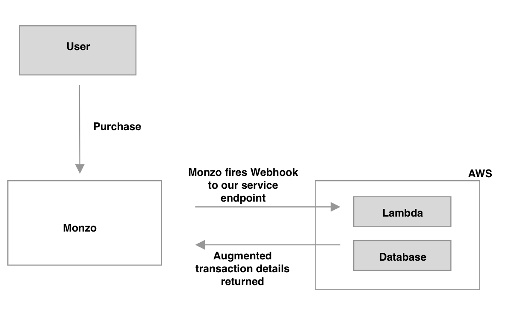

- [] Setup remote state bucket
- [] AddFeedItem

**Tech**
You will need to sign into the [developers portal](https://developers.monzo.com) with your registered Monzo account email to get the required access token.

Run the Typscript compiler
`tsc`

Create the lambda Zip file for Terraform

<!-- `zip -r infrastructure/augmentLambda.zip dist/index.js` -->

`cd dist && zip -r ../infrastructure/augmentLambda.zip index.js`

To create the infrastructure...
`cd ../infrastructure && terraform apply`

Create a log group for monitoring the lambda in Cloudwatch
https://eu-west-1.console.aws.amazon.com/cloudwatch/home?region=eu-west-1#logs:
/aws/lambda/augment-transaction

If you make changes to the lambda, run the following from the root directory
`./updateLambda.sh`
