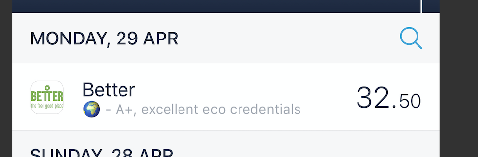
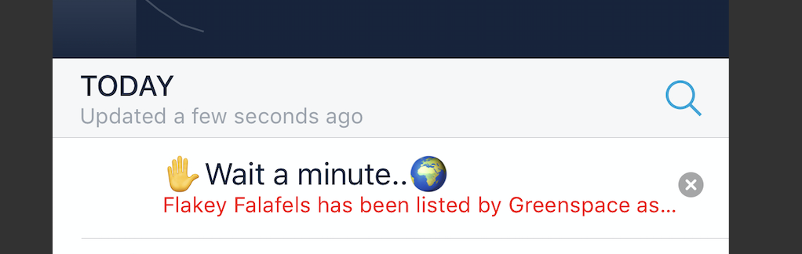
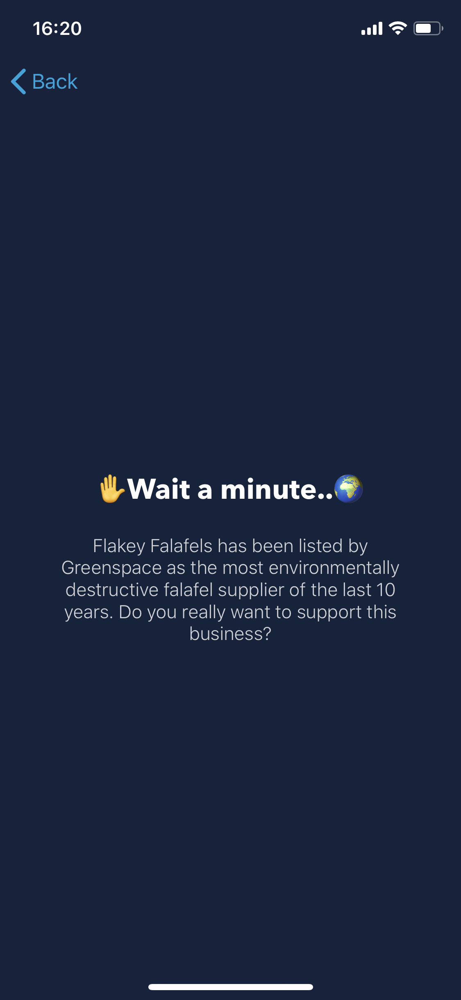

## How can Open Banking aid ethical purchase decisions??

This repo accompanies a blog piece I wrote [here](https://blog.red-badger.com/how-can-open-banking-aid-ethical-purchase-decisions)

I would normally use the Serverless framework but thought it would be interesting to use Terraform for a change.

### Summary

- When a transation occurs in the Monzo app, we receives a webhook from Monzo with the retailer info.
- We then check if the retailer is in our (fictional) database of ethical company data.
- If the retailer is in our fictional database and the rating is very poor, we create a feed item that we fire back into the Monzo app.
- If the retailer is in our fictional database and the rating is excellent, we can also create the the feedback item to fire back.
- To stop it becoming spammy, we probably don't want to do this for all transactions, simply the best and worst.

### What does it look like ?

Adding a note to an existing feed item...

Inserting a new feed item...

Clicking through on the new feed item....

