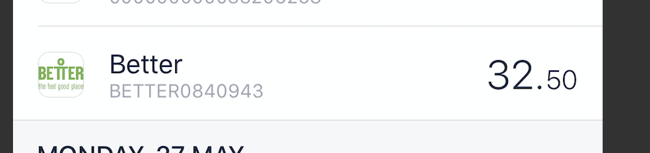
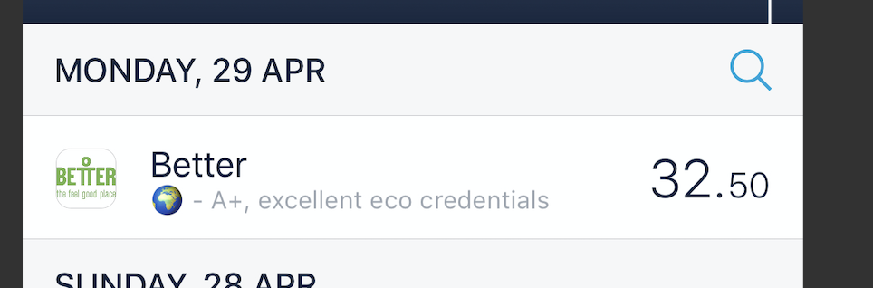

**Helping consumers make ethical decisions with open banking**

The goal is make it to put ethical / environmental data more visible in day to day life, making it easier for ethical consumers to make more informed choices about where they choose to spend their money.

The hypothesis here is that it would be most effective to harness the opportunities afforded by open banking, and augment existing banking apps with extra information, in a similar way to how external companies such as [Flux](https://www.tryflux.com/) integrate with Monzo to provide itemised receipts. Rather people needing to remember about a new app, we could get the information in front of their eyes with a lot less friction.

Whilst some of the traditional banks are quite likely to be wary of this approach, given issues such as funding new fossil fuel projects (boo [HSBC](https://www.theguardian.com/business/2019/mar/06/investors-urge-hsbc-to-close-coal-loophole-in-energy-policy)), we can dream that 'challenger' banks built on a different set of ethics will be more receptive. 🤞And going by their choice of [organic cotton](https://monzo.teemill.co.uk/) for their t-shirts i'm particularly hopeful that Monzo would be open to the idea, so have worked around their API and mobile app.

So, this is a little proof of concept built to integrate with the Monzo api.

**What does it do?**
When a transaction occurs Monzo let's us know via a webhook, which contains the required details such as the retailer. We then cross check the retailer with our fictional (for now) database. This database might hold positive information on retailers such as awards and environmental certificates from organisitions such as the [Carbon Trust](), [Natural Capital Partners](https://www.naturalcapitalpartners.com/) and [BCorp](). At the same time, if an organisation such as Greenpeace has said that a company is the worst offender in an area, then that data will also be returned.

**What will I see?**

The first iteration of this project involves augmenting a transation and sending it back into a users feed. It looks like this within the feed.

#1
To help those who are less familiar with the monzo app, here is a feed item for my swimming pool membership as it first appeared in the feed.

And here is the transaction with our new environmental note added..

This is a start - we are partly acheiving our goal of giving a consumer the information, but it is a bit underwhelming (forget the wording of the text which is deliberatly fluffy at this point). It fights for space with other information such as company name, and it's easy to miss. Not to mention that we are writing over some sort of reference number for the transaction by adding our own (arguably far more valuable) note\*(obvs could append but no space anyway). Finally there is no way of showing images( that i have found yet), as it simply a string. Although the emoji is nice!

#2
So the second iteration is realising that instead of augmenting a transation, we could fire a [feed item](https://docs.monzo.com/#feed-items) into the users feed. This gives us a bit more space to play with, and removes the risk that the 'note' is overwriten.

So this approach looks like this...

---

**Limitations and future investigations**

Before, not after
Obviously, it would be much better for our ethical consumer to be told _before_ they make a purchase. But hopefully it currently may be enough to make the consumer to consider whether that business is one that they should support. In some cases, it might even prompt someone to turn around and return the goods. Perhaps even our our ethical banking freinds at Monzo (🙌)would allow us to block future payments as a statement if a business had crossed our ethical line of no return in its' business practices.

I particularly like the idea of some of these businesses playing catchup and but getting stuck on having to display their lack of ethics in their own apps, although this will probably remain a dream!

So how we might provide the consumer with information before purchase? This is likely to become my next little project.

**Tech**

We need to create the bucket first before running Terraform, due to the lambda needing to be in the bucket
`aws s3api create-bucket --bucket augment-transaction-bucket --region eu-west-1 --create-bucket-configuration LocationConstraint=eu-west-1`

To test the lambda from the cli, invoke with.....
`aws lambda invoke --region=eu-west-1 --function-name=augmentation-transaction --payload "{ type: "transaction.created", data: { description: "Wow Coffee" } }"`

To update lambda...
`./updateLambda.sh`
